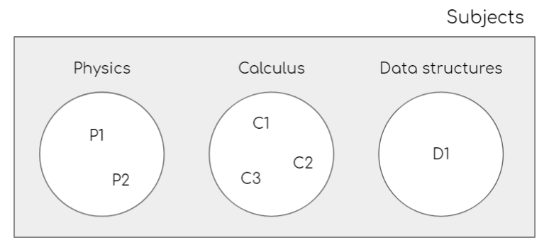

# Schedule Maker

Based on the idea of [Cronun](https://cronun.co/schedules), this project attempts to help students in the process of making a new schedule for the next semester.

## Project setup

The only dependency so far is xlwt

### Download the dependencies with pip

```
pip install -r requirements.txt
```

## Algorithm

### Input

The input is a set of subjects and each subject a set courses



> P1 and P2 are courses

A _course object_ must have a field indicating its schedule. This is necessary to determine if some of its classes overlap with other classes.

Before using the algorithm it may be useful to transform the hours and days into matrix indices

Course Schedule = 07/Monday to 08/Monday
Course Schedule = 0/0 to 1/0

> 6:30 AM is the first class hour of a day 

### Combinations

To find all combinations of schedules, we use the cartesian product. We get a new set of schedules where each element is a set of courses

```python
# Using the input example we get these combinations
[
  ('D1', 'P1', 'C1'), 
  ('D1', 'P1', 'C2'), 
  ('D1', 'P1', 'C3'), 
  ('D1', 'P2', 'C1'), 
  ('D1', 'P2', 'C2'), 
  ('D1', 'P2', 'C3')
]
```

> The size of the new set is the multiplication of each subject set size, in our case is 2 x 3 x 1 = 6

### Filter

To finish the algorithm, we need to filter those schedules that are invalid

A schedule is invalid if two classes overlap each other

**Invalid schedule:**

|       | Monday  | Tuesday         | Wednesday |
|-------|---------|-----------------|-----------|
| 6:30  |         | Class A         | Class B   |
| 7:30  |         |                 |           |
| 8:30  | Class A | Class B Class D |           |
| 9:30  |         |                 |           |

**Valid schedule:**

|       | Monday  | Tuesday | Wednesday |
|-------|---------|---------|-----------|
| 6:30  |         | Class A | Class B   |
| 7:30  |         |         |           |
| 8:30  | Class A | Class B |           |
| 9:30  |         |         | Class D   |

### Pre Filters

Sometimes we want to apply some filters in order to reduce the scope of the schedules generated

Some pre filters may be

* filter by professor
* filter by accepting only specific courses

Try to apply the filters before the cartesian product because this algorithm is the most expensive of all

### Summary

1. Get the input
1. Process and clean the input
1. Apply pre filters
1. Apply cartesian product
1. Filter invalid schedules

## How to use

Before starting to generate schedules, is necessary to download (scraping) the subject json files that you want in your schedule, 

Subject json file structure:

```javascript
{
  "0": {
    "name": "str",
    "nrc": "str",
    "professors": [
        { "first_name": "str", "last_name": "str" },
        ...
    ],
    "schedule": [
      {
        "day": "str",
        "interval": { "start": "str", "end": "str" },
      },
      ...
    ]
  },
  "1": {
     ...
  }
},

// each item in this object represents a course of that subject
// day: M|T|W|R|F|S
// hour: HHMM, HH: military hour ex: (09, 15), MM: minutes

```

You must put these files in my_subjects folder

Now you have to create a json file called my_schedule_info.json in the parent folder to specify how to create the combination of schedules

```javascript
[
    {
        "professors_to_ignored": ["str", ...],
        "subject_file_path": "my_subjects/<subject_name>.json",
        "nrc_to_ignored": ["str", ...],
    },
]

// The path to the subject file is required, the other two attributes are optional

```

Finally, run the command

```
python schedule_maker.py
```

All schedules are save in my_schedules folder